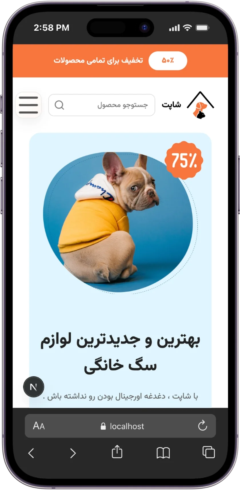

<div align="center">

🐾 Shopet

Modern Full-Stack Pet Shop built with Next.js

A modern, responsive and user-friendly full-stack pet shop application built with Next.js, React and Node.js, featuring product management, shopping cart, wishlist, authentication, blog, search, order tracking and more.


</div>

⸻

✨ Features

🛍️ E-Commerce

* 🐶 Modern Pet Shop Landing Page
* 🛍 Product Catalog
* 📄 Product Details
* 🐱 Cat Food
* 🐕 Dog Food
* 🐾 Pet Accessories
* 🔍 Product Search
* ❤️ Wishlist / Favorites
* 🛒 Shopping Cart
* 💳 Checkout UI
* 📦 Order Tracking

📝 Blog

* 📚 Blog Listing
* 📄 Dynamic Article Pages
* 🏷️ Categories & Tags
* 👤 Author Information
* 📅 Publication Date
* ⏱️ Reading Time

🔐 Authentication

* 📱 Phone Number Authentication
* 🔢 OTP Verification
* 👤 User Profile
* 🔒 Authentication State
* 🚪 Logout
* 🍪 Cookie-based Authentication

📄 Other Pages

* ❓ FAQ
* 📞 Contact
* ℹ️ About
* 🔒 Privacy Policy
* 📜 Terms & Conditions
* 🚚 Order Tracking

🎨 UI / UX

* 📱 Fully Responsive
* 🖥️ Desktop & Mobile Design
* 🎨 Modern UI/UX
* ♿ Accessibility
* ⚡ Optimized Images
* 🔔 Toast Notifications
* 🧩 Reusable Components
* 🌙 Clean Component Architecture

⸻

🚀 Tech Stack

Frontend

Technology	Usage
Next.js 16	React Framework
React 19	UI Library
JavaScript ES2024+	Programming Language
CSS Modules	Component Styling
React Hook Form	Form Management
Yup	Form Validation
React Query	Server State Management
React Hot Toast	Notifications
Lucide React	Icons
Next/Image	Image Optimization

Backend

Technology	Usage
Node.js	Runtime
Express.js	REST API
REST API	Client/Server Communication
Cookie Authentication	Authentication
OTP	Phone Verification
dotenv	Environment Variables

⸻

🏗️ Architecture

Shopet is structured as a full-stack application with a separated frontend and backend.

┌──────────────────────────────┐
│          Frontend            │
│                              │
│      Next.js + React         │
│                              │
│  Components / Pages / UI     │
└──────────────┬───────────────┘
               │
               │ REST API
               ▼
┌──────────────────────────────┐
│           Backend            │
│                              │
│       Node.js + Express      │
│                              │
│   Authentication / Products  │
│       Articles / Orders      │
└──────────────────────────────┘

⸻

📁 Project Structure
```
shopet/
│
├── frontend/
│   │
│   ├── app/
│   │   ├── about/
│   │   ├── blog/
│   │   │   └── [slug]/
│   │   ├── cart/
│   │   ├── catfood/
│   │   ├── dogfood/
│   │   ├── dogsProducts/
│   │   ├── faq/
│   │   ├── favorites/
│   │   ├── login/
│   │   ├── pet-tools/
│   │   ├── privacy/
│   │   ├── products/
│   │   │   └── [id]/
│   │   ├── profile/
│   │   ├── shop/
│   │   ├── tracking/
│   │   ├── conditions/
│   │   ├── contact/
│   │   └── page.js
│   │
│   ├── Components/
│   │   ├── Module/
│   │   │   ├── Blog/
│   │   │   ├── Products/
│   │   │   ├── SearchBar/
│   │   │   ├── SearchResult/
│   │   │   ├── PetTools/
│   │   │   └── SpecialProducts/
│   │   │
│   │   └── UI/
│   │       └── ProductCard/
│   │
│   ├── context/
│   │   ├── CartContext.js
│   │   ├── FavoritesContext.js
│   │   └── SearchContext.js
│   │
│   ├── Services/
│   │   ├── productService.js
│   │   ├── articleService.js
│   │   └── auth.js
│   │
│   ├── public/
│   │   ├── Icon/
│   │   ├── Logo/
│   │   ├── pic/
│   │   └── README/
│   │
│   ├── .env.local
│   ├── package.json
│   └── next.config.js
│
├── backend/
│   │
│   ├── src/
│   │   ├── controllers/
│   │   ├── routes/
│   │   ├── services/
│   │   ├── middleware/
│   │   ├── models/
│   │   └── server.js
│   │
│   ├── .env
│   ├── package.json
│   └── ...
│
└── README.md

⸻
``` 

🔌 API

The frontend communicates with the backend through REST APIs.

Products

GET    /api/products
GET    /api/products/:id

Articles

GET    /api/articles
GET    /api/articles/:slug

Authentication

POST   /api/auth/send-otp
POST   /api/auth/verify-otp
GET    /api/auth/me
POST   /api/auth/logout

⸻

🔐 Authentication Flow

Shopet uses phone-number authentication with OTP verification.

User
 │
 ▼
Enter Phone Number
 │
 ▼
POST /api/auth/send-otp
 │
 ▼
Receive OTP
 │
 ▼
Enter OTP
 │
 ▼
POST /api/auth/verify-otp
 │
 ▼
Authentication Cookie
 │
 ▼
Authenticated User

⸻

⚙️ Environment Variables

Frontend

Create:

frontend/.env.local
NEXT_PUBLIC_API_URL=http://localhost:3001/api

Backend

Create:

backend/.env

Add the required backend configuration:

PORT=3001

Additional authentication, database or service variables can be configured according to the backend environment.

⸻

📦 Installation

1. Clone the repository

git clone https://github.com/yourusername/shopet.git
cd shopet

⸻

2. Install Frontend

cd frontend
npm install

⸻

3. Install Backend

Open another terminal:

cd backend
npm install

⸻

▶️ Running the Project

The frontend and backend need to run simultaneously.

Start Backend

cd backend
npm start

Backend:

http://localhost:3001

⸻

Start Frontend

In another terminal:

cd frontend
npm run dev

Frontend:

http://localhost:3000

⸻

🧪 Development

Frontend development server:

npm run dev

Production build:

npm run build

Production server:

npm start

Backend:

npm start

⸻

📚 Main Packages

Frontend

Next.js

npm install next react react-dom

React Hook Form

npm install react-hook-form

Yup

npm install yup
npm install @hookform/resolvers

React Query

npm install @tanstack/react-query

Notifications

npm install react-hot-toast

Icons

npm install lucide-react

⸻

🖼️ Image Optimization

Shopet uses Next.js Image Optimization through:

import Image from "next/image";

Images are optimized using:

* Responsive image rendering
* Defined image dimensions
* Next/Image optimization
* Modern image formats where applicable

⸻

📱 Responsive Design

The application is designed for:

* 📱 Mobile
* 📱 Tablet
* 💻 Laptop
* 🖥️ Desktop

The UI adapts to different screen sizes while maintaining usability and visual consistency.

⸻

⚡ Performance

* ⚡ Next.js App Router
* 🚀 Server Components where appropriate
* 🖥️ Client Components only where required
* 🖼️ Next/Image optimization
* 📦 Component-based architecture
* 🔄 Efficient API requests
* 📱 Mobile-first responsive design
* 🧹 Clean reusable components
* ⚡ Production build optimization

⸻

♿ Accessibility

The application follows common accessibility practices including:

* Semantic HTML
* Accessible buttons
* Descriptive image alt attributes
* Keyboard-friendly interactions
* Clear navigation
* Responsive layouts

⸻

📸 Preview

Desktop


⸻


⸻


⸻


⸻


⸻


⸻

📱 Mobile




⸻

🐾 Social Impact

<div align="center">

10,000+

Animals Helped

Since 2021

❤️ Every pet deserves a better life.

</div>

⸻

👨‍💻 Author

Parichehr

IT Engineer

Front-end Developer

⸻

⭐ Support

If you like this project, don’t forget to give it a ⭐

⸻

📄 License

This project is created for educational and portfolio purposes.